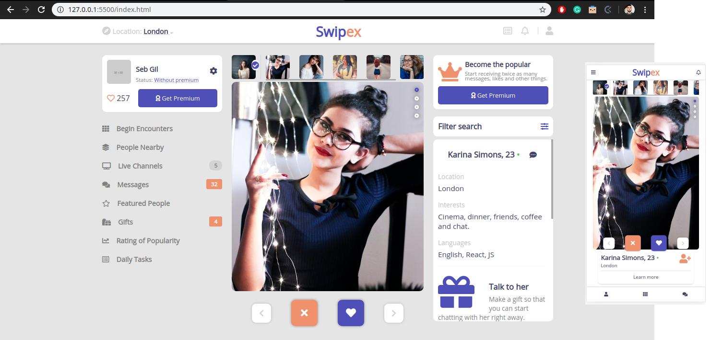
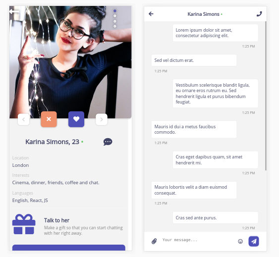

# Social Network concept

> This is a website for a responsive social network based on a design by [Vlad Ermakov](https://dribbble.com/ermalength).

The basic requirements for this project include having:

- The person detail page, with a link to the next/previous person detail and a link to the chat page.
- The chat page, with a list of chats that link to the chat detail page.
- The chat detail page.

Each of these pages should have versions for 2 different screen sizes: 

- Mobile & tablet: up to 1024px.
- Desktop: from 1024px.

Follow the guidelines of the given design, including:

- Colors
- Typographies: font face (as Helvetica Neue is a paid font, you may use a similar one like Open Sans), size and weight.
- Layout: composition and space between elements, for the 2 given screen sizes.

Original design: [Here](https://www.behance.net/gallery/70285515/Swipex-This-application-for-dating)

## Screenshot

## Built With

- HTML5, CSS3
- Flexbox
- Sass
- BEM (naming structure)

## Live Demo

[Live Demo Link](https://rawcdn.githack.com/lBuggie/social-network/8d2ca79745691ab21801c74c85b9c185bbcf2c68/index.html)

## Authors

👤 **Sebastian Gil Rodriguez**

- Github: [@lBuggie](https://github.com/sebGilR)
- Twitter: [@sebGilR](https://twitter.com/sebGilR)
- Linkedin: [linkedin](https://www.linkedin.com/in/sebastianGilRodriguez)

## 🤝 Contributing

Contributions, issues and feature requests are welcome!

Feel free to check the [issues page](issues/).

## Show your support

Give a ⭐️ if you like this project!

## Acknowledgments

- Design concept by [Vlad Ermakov](https://dribbble.com/ermalength).
